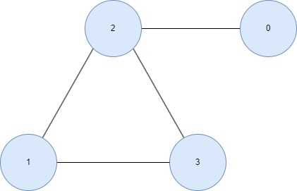

#Graphs

## Types of Graphs

There are three kinds of graph:

* Directed or Undirected;
* Weighted or Unweighted;
* Cyclic or Acyclic;

## Graph data

there are three ways to mean the graph data:



1. Edge list:

```javascript
const graph = [[0,2],[2,3],[2,1],[1,3]];
```

2. Adjacent list:

```javascript
const graph = [[2], [2,3], [0,1,3], [1,2]];

// or

const graph = {
    0: [2],
    1: [2,3], 
    2: [0,1,3], 
    3: [1,2]
};

```

3. Adjacent Matrix:

```javascript

const grapth = [
    [0, 0, 1, 0],
    [0, 0, 1, 1],
    [1, 1, 0, 1],
    [0, 1, 1, 0]
]

```


